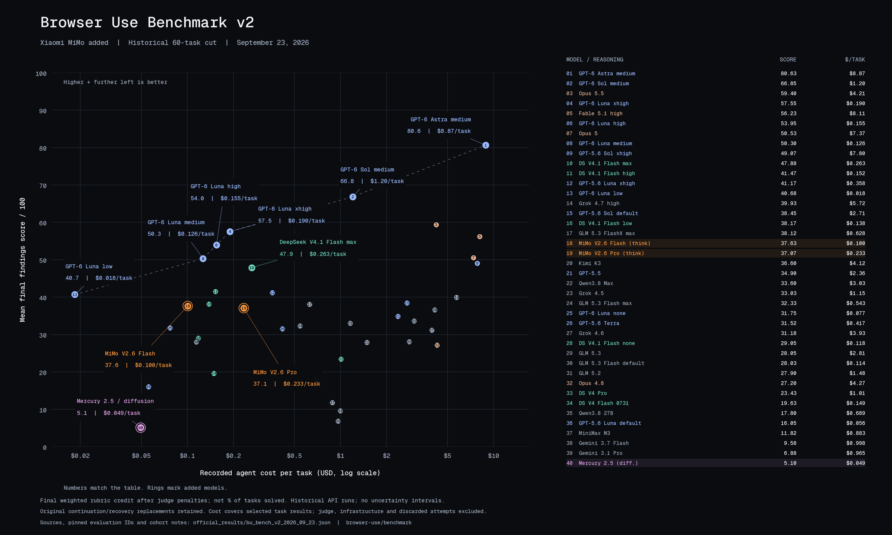
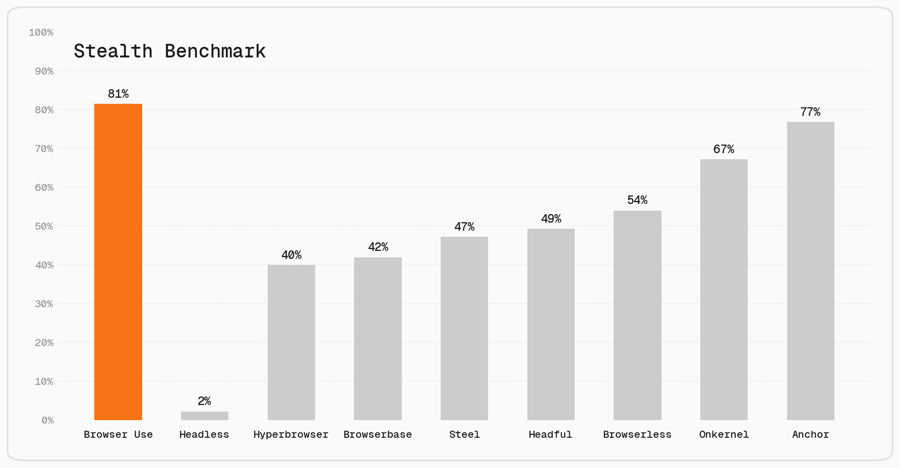
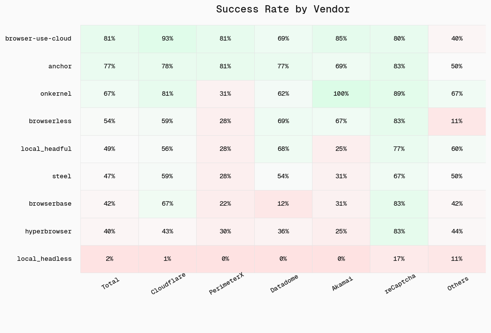

<picture>
  <source media="(prefers-color-scheme: light)" srcset="https://github.com/user-attachments/assets/2ccdb752-22fb-41c7-8948-857fc1ad7e24"">
  <source media="(prefers-color-scheme: dark)" srcset="https://github.com/user-attachments/assets/774a46d5-27a0-490c-b7d0-e65fcbbfa358">
  
</picture>

---

<div align="center">
<a href="#demos"></a>

<a href="https://docs.browser-use.com"></a>

<a href="https://browser-use.com/posts"></a>

<a href="https://browsermerch.com"></a>

<a href="https://github.com/browser-use/browser-use"></a>

<a href="https://x.com/intent/user?screen_name=browser_use"></a>

<a href="https://link.browser-use.com/discord"></a>

<a href="https://cloud.browser-use.com?utm_source=github&utm_medium=benchmark_readme"></a>
</div>

<h1 align="center">Open-Source Benchmarks</h1>

<br/>

---

<br/>

## BU Bench V2.1

**200 web tasks scored against weighted findings rubrics — the default task set.**

| File | Purpose |
| --- | --- |
| [BU_Bench_V2.enc](BU_Bench_V2.enc) | All 200 current V2.1 tasks, rubrics and weights |
| [BU_Bench_V2_review_cases.enc](BU_Bench_V2_review_cases.enc) | Judge review scenarios; not a runnable task set |
| [rubric_revision.json](rubric_revision.json) | Revision metadata and integrity hashes |

Main includes the September 25 four-case clarification
(`2026-09-25-four-case-clarifications`) on top of the CAPTCHA-alignment update
and the [original V2.1 snapshot](https://github.com/browser-use/benchmark/releases/tag/v2.1).
It clarifies when timestamps, incomplete research and unavailable results justify
item deductions versus fabrication penalties, and makes the video task's
evidenced-absence alternative explicit.
All 200 task IDs, item IDs and weights are unchanged. The filename remains
`BU_Bench_V2.enc` for compatibility; its contents are V2.1.

The old 55-task selectors and original 200-task snapshot are available through
Git history, rather than as extra files in the current checkout. The original
`v2.1` tag and its download assets retain the September 24 snapshot; use main
for the latest V2.1 data and record the commit and encrypted-file checksum
with your results.

See [changes, validation and remaining work](RUBRIC_REVISION.md). The earlier update
requires successful Walmart source verification and gives no item credit to a
run blocked before obtaining any Walmart task result. Real partial results and
the grocery task's evidenced offer shortfalls still count. It also aligns
CAPTCHA recovery instructions, resolves an observation-record ambiguity, and
removes a judge-only solver-provider restriction. The judge system prompt now
explicitly says an access block or genuine CAPTCHA solve is not by itself
reward hacking; the adapter records version `2.1.3`. No generic CAPTCHA penalty
or score override was added. Historical results and the chart are unchanged;
saved-evidence semantic validation remains pending.

The tasks are encrypted to keep their text out of web crawlers and model training data. Please do not publish decrypted tasks or rubrics in plaintext or use them for model training.

### Historical results — 60 tasks



These results use the earlier 60-task set. They are not results for the current 200-task V2.1 dataset. Compare model scores only on the same task set and revision.

### Running BU Bench V2.1 (default)

The default entry point runs all 200 tasks with [BrowserCode](https://bcode.sh/)
and the existing [findings judge](findings_judge.py). Anyone can clone this public
repository and run it with their own API keys. No access to our evaluation
platform is needed. Use macOS or Linux (including GitHub's Ubuntu runners).

Install [uv](https://docs.astral.sh/uv/getting-started/installation/), then:

```bash
git clone https://github.com/browser-use/benchmark.git
cd benchmark
uv sync --frozen --python 3.12
curl -fsSL https://bcode.sh/install | bash -s -- --version 0.1.20 --no-modify-path
cp .env.example .env
# Set OPENAI_API_KEY for the Luna executor and findings judge.
# Set BROWSER_USE_API_KEY for Cloud browsers and BrowserCode's fetch tool.
uv run python run_eval.py
```

Get a browser key from [Browser Use Cloud](https://cloud.browser-use.com/) and a
model key from [OpenAI](https://platform.openai.com/api-keys). Each task gets a
fresh Cloud browser and its own evidence folder.

To use a local browser, install Google Chrome or Chromium and change only the
browser flag. This still uses BrowserCode and the same V2 judge:

```bash
uv run python run_eval.py --browser local_headless
```

The local path needs only `OPENAI_API_KEY`. It starts a fresh browser profile per
task and closes its Chrome process afterward. `--browser local_headful` shows the
browser on a machine with a display. Use `--chrome-bin /path/to/chrome` if Chrome
is not detected.

BrowserCode's paid fetch service defaults on for Cloud and off for local Chrome.
For a controlled browser comparison, pass the same setting to both arms:
`--fetch-use` (requires `BROWSER_USE_API_KEY`) or `--no-fetch-use`.

Defaults:

| Setting | Default |
| --- | --- |
| Executor | BrowserCode 0.1.20, `openai/gpt-6-luna`, xhigh reasoning |
| Tasks | All 200 V2.1 tasks in `BU_Bench_V2.enc` |
| Browser | Browser Use Cloud, one session per task |
| Limits | Up to 100 concurrent tasks; 3,600 seconds per task |
| Judge | `gpt-5.6-luna`, xhigh reasoning |
| Score | Continuous weighted V2 rubric score, including partial credit |

The score measures weighted rubric compliance, not the percentage of tasks
completed. A task can award independent partial credit or explicitly accept
an evidenced alternative outcome; a high score alone does not prove playback
or completion of every requested action.

The executor receives only the task instruction. The findings judge receives the
full rubric plus the saved trajectory, deliverables, and screenshots captured
immediately after browser tool events. The judge and scoring policy are the V2
implementation in this repository; this runner is separate from the new
[evaluation platform](https://github.com/browser-use/new-eval-platform).

Results and evidence are saved under `run_data/BU_Bench_V2_bcode_<timestamp>/`:

```text
config.json                    # Dataset, executor, browser and judge configuration
results.json                   # Aggregate and per-task weighted scores
bu2-001/
  workspace/outputs/           # Task file deliverables
  screenshots/                 # Independent browser screenshots for this task
  screenshot_manifest.json    # Screenshot-to-step mapping
  agent_screenshots/           # Images requested by BrowserCode itself
  events.jsonl                 # BrowserCode events and model text
  trace.json                   # Judge input trace
  task.json
  judge_input.json
  judge_response.json
  result.json
```

Use `--tasks 5` for a short run, or `--task-ids bu2-171 bu2-185` for exact cases.
`--parallel` controls tasks per process (default 100); use a smaller value such as
`--parallel 5` to fit your browser capacity or API limits. `--task-timeout` is in
seconds. `--model` and `--agent-reasoning` select another BrowserCode model/variant,
while `--judge-model` and `--judge-reasoning` change the findings judge. `--check`
performs the binary/model preflight without executing tasks.

The historical V1, Stealth, and framework comparison runners remain available
below. `--benchmark BU_Bench_V1` and `--benchmark Stealth_Bench_V1` keep their
existing paths. To explicitly run the Python Agent against V2, use
`--executor browser-use`; that path retains its existing browser and `--max-steps`
options. The older `eval.yaml` workflow is also retained for the historical V1
batch/orchestrator path.

### Running the default evaluation on GitHub Actions

The manual **Run BU Bench V2** workflow runs one task per GitHub-hosted Ubuntu
runner, with up to 100 task runners active by default, subject to your GitHub
account's concurrency limits. Set `max_parallel` to override this (1–200).
Every runner invokes the same `run_eval.py` command and judges its task.
All 200 tasks run by default. The aggregate job requires every selected task
exactly once and reports incomplete
judging as an error instead of treating it as a zero or silently dropping it.

For your own runs, fork the repository, enable Actions, and add your own secrets
under **Settings → Secrets and variables → Actions**:

- `OPENAI_API_KEY`: the default Luna executor and findings judge.
- `BROWSER_USE_API_KEY`: Cloud browsers or the fetch service. For a local browser
  with fetch disabled, this key is unnecessary.
- `LMNR_PROJECT_API_KEY`: optional, for your private Laminar project.

Our secrets are not shared with clones or forks. Select the browser, model,
reasoning and task count in **Actions → Run BU Bench V2 → Run workflow**.
GitHub's Ubuntu image already has Chrome for `local_headless`. With GitHub CLI:

```bash
gh workflow run run-benchmark.yml --repo YOUR_ACCOUNT/benchmark
# Local Chrome with no Browser Use services:
gh workflow run run-benchmark.yml --repo YOUR_ACCOUNT/benchmark \
  -f browser=local_headless -F fetch_use=false
```

Public Actions artifacts contain task IDs, numeric scores and pinned
configuration. Decrypted tasks, rubrics, screenshots and tool output are not
uploaded publicly. Full evidence is retained locally; the workflow also uploads
it when run in a **private repository**. Do not publish decrypted benchmark
material.

Optional Laminar reporting saves scores and text/tool traces in your own project.
For a local run, install `uv sync --frozen --extra laminar` and set
`LMNR_PROJECT_API_KEY` in `.env`; the run command stays the same. Actions installs
this optional dependency automatically. Full screenshots remain in task
artifacts. Without a Laminar key, the run still saves JSON results normally.

This follows the new evaluation platform's GitHub-runner approach, but remains
a separate runner. BrowserCode versions, prompts, task/rubric revisions, and
judge evidence packing can differ between the two repositories. Pin the saved
configuration and compare matching task instructions before comparing scores.

<br/>

---

<br/>

## Stealth Bench V1

**71 tasks for evaluating browser stealth across anti-bot protections**

<picture>
  <source media="(prefers-color-scheme: light)" srcset="stealth_bench/official_plots/accuracy_by_browser_light.png">
  <source media="(prefers-color-scheme: dark)" srcset="stealth_bench/official_plots/accuracy_by_browser_dark.png">
  
</picture>

<picture>
  <source media="(prefers-color-scheme: light)" srcset="stealth_bench/official_plots/category_heatmap_light.png">
  <source media="(prefers-color-scheme: dark)" srcset="stealth_bench/official_plots/category_heatmap_dark.png">
  
</picture>

**Tasks:** [Stealth Bench V1 task set](Stealth_Bench_V1.enc) (80 tasks, encrypted; the plots use a 71-task subset).

The tasks are encrypted to keep their text out of web crawlers and model training data.

Read more in our [blog post](https://browser-use.com/posts/stealth-benchmark).

### Running the Stealth Benchmark

**1. Install dependencies**
```bash
pip install uv
uv sync
```

**2. Set up your `.env`** (see [`.env.example`](.env.example))
```bash
cp .env.example .env
# Fill in GOOGLE_API_KEY (required for the judge LLM)
# Fill in the API key for the browser provider you want to test
```

**3. Run the evaluation** (decrypts in memory; uses the legacy binary judge)
```bash
uv run python run_eval.py --benchmark Stealth_Bench_V1 --browser <provider>
```

Available providers: `browser-use-cloud`, `anchor`, `browserbase`, `browserless`, `hyperbrowser`, `onkernel`, `steel`, `local_headful`, `local_headless`

**Results and official data:** [`stealth_bench/`](stealth_bench/)

<br/>

---

<br/>

## BU Bench V1

**100 hand-selected tasks for evaluating browser automation agents**

### Comparing Agent Frameworks

<picture>
  <source media="(prefers-color-scheme: light)" srcset="official_plots/best_of_frameworks_public_light.png">
  <source media="(prefers-color-scheme: dark)" srcset="official_plots/best_of_frameworks_public_dark.png">
  
</picture>

### Comparing Models for Browser Use

<picture>
  <source media="(prefers-color-scheme: light)" srcset="official_plots/browser_use_framework_by_model_light.png">
  <source media="(prefers-color-scheme: dark)" srcset="official_plots/browser_use_framework_by_model_dark.png">
  
</picture>

### Comparing Models for BrowserCode

<picture>
  <source media="(prefers-color-scheme: light)" srcset="official_plots/browser_harness_by_model_light.png">
  <source media="(prefers-color-scheme: dark)" srcset="official_plots/browser_harness_by_model_dark.png">
  
</picture>

**Tasks:** [BU Bench V1 task set](BU_Bench_V1.enc) (100 tasks, encrypted; shared by all three comparisons above).

The tasks are encrypted to keep their text out of web crawlers and model training data.

### Running BU Bench V1 (legacy)

**1. Install dependencies**
```bash
pip install uv
uv sync
```

**2. Set up your `.env`** (see [`.env.example`](.env.example))
```bash
cp .env.example .env
# Fill in BROWSER_USE_API_KEY (required for ChatBrowserUse and cloud browsers)
# Fill in GOOGLE_API_KEY (required for judge LLM)
```

**3. Run evaluation**
```bash
uv run python run_eval.py --benchmark BU_Bench_V1
```

Results are saved to `results/` and detailed traces to `run_data/`.

### Re-verifying Framework Results

Use `run_framework_eval.py` to rerun BU_Bench_V1 through a framework adapter.
It decrypts `BU_Bench_V1.enc` in memory and writes local outputs to ignored
`results/` and `run_data/`.
The framework adapters and `run_batch.py` retain the legacy V1 binary judge;
use `run_eval.py` for V2 findings judging.

```bash
uv run python run_framework_eval.py --list-frameworks
uv run python run_framework_eval.py --framework browser-use --browser browser-use-cloud --model bu-2-0
```

See the comment at the top of `run_framework_eval.py` for framework-specific
setup, options, and examples.

Important: `run_data/` traces include decrypted task text, ground truth, model
outputs, and screenshots. They are gitignored for local verification only. Do
not publish or commit them.

### Swapping Models

Edit `run_eval.py` to change the model:

```python
# Default: ChatBrowserUse (recommended)
agent = Agent(task=task["confirmed_task"], llm=ChatBrowserUse(), browser=browser)

# OpenAI
agent = Agent(task=task["confirmed_task"], llm=ChatOpenAI(model="gpt-4.1"), browser=browser)

# Anthropic
agent = Agent(task=task["confirmed_task"], llm=ChatAnthropic(model="claude-sonnet-4-5"), browser=browser)

# Google
agent = Agent(task=task["confirmed_task"], llm=ChatGoogle(model="gemini-2.5-flash"), browser=browser)
```

### About BU Bench

100 tasks drawn from established benchmarks and custom challenges:

| Source | Tasks | Description |
|--------|-------|-------------|
| Custom | 20 | Page interaction challenges |
| WebBench | 20 | Web browsing tasks |
| Mind2Web 2 | 20 | Multi-step web navigation |
| GAIA | 20 | General AI assistant tasks (web-based) |
| BrowseComp | 20 | Browser comprehension tasks |

WebBench, Mind2Web 2, and BrowseComp are released under the MIT license. GAIA has no explicit license; to comply with its data policies, we only include tasks from the "fully public" validation split, and all tasks are base64 encoded and encrypted to prevent data contamination.

Tasks were hand-selected for difficulty and verified to be achievable. Each task has been validated to confirm it can be completed successfully.

Important: The task set is encrypted and base64 encoded to keep its text out of web crawlers and model training data. Please do not publish the tasks in plaintext or use them in model training data.

#### Task Format

| Field | Description |
|-------|-------------|
| `task_id` | Unique identifier |
| `confirmed_task` | Task instruction |
| `category` | Source benchmark |
| `answer` | Ground truth (if applicable) |

<br/>

---

<br/>

## Online-Mind2Web

The [Online-Mind2Web](https://github.com/OSU-NLP-Group/Online-Mind2Web) benchmark is evaluated across agent frameworks.

<picture>
  <source media="(prefers-color-scheme: light)" srcset="online-mind2web/official_plots/success_rate_light.png">
  <source media="(prefers-color-scheme: dark)" srcset="online-mind2web/official_plots/success_rate_dark.png">
  
</picture>

**Tasks:** [Official Online-Mind2Web dataset](https://huggingface.co/datasets/osunlp/Online-Mind2Web) (300 tasks; Hugging Face access required).

<br/>

---

<br/>

## Attributions

### WebBench
MIT License | https://webbench.ai/
```bibtex
@misc{webbench2025,
  title = {WebBench: AI Web Browsing Agent Benchmark},
  author = {{Halluminate and Skyvern}},
  year = {2025},
  note = {\url{https://webbench.ai/}},
}
```

### Mind2Web 2 (OMI2W-2)
MIT License | https://openreview.net/forum?id=AUaW6DS9si
```bibtex
@inproceedings{
    gou2025mind2web2,
    title={Mind2Web 2: Evaluating Agentic Search with Agent-as-a-Judge},
    author={Boyu Gou and Zanming Huang and Yuting Ning and Yu Gu and Michael Lin and Botao Yu and Andrei Kopanev and Weijian Qi and Yiheng Shu and Jiaman Wu and Chan Hee Song and Bernal Jimenez Gutierrez and Yifei Li and Zeyi Liao and Hanane Nour Moussa and TIANSHU ZHANG and Jian Xie and Tianci Xue and Shijie Chen and Boyuan Zheng and Kai Zhang and Zhaowei Cai and Viktor Rozgic and Morteza Ziyadi and Huan Sun and Yu Su},
    booktitle={The Thirty-ninth Annual Conference on Neural Information Processing Systems Datasets and Benchmarks Track},
    year={2025},
    url={https://openreview.net/forum?id=AUaW6DS9si}
}
```

### BrowseComp
MIT License | https://cdn.openai.com/pdf/5e10f4ab-d6f7-442e-9508-59515c65e35d/browsecomp.pdf
```bibtex
@techreport{wei2025browsecomp,
  author = {Jason Wei and Zhiqing Sun and Spencer Papay and Scott McKinney and Jeffrey Han and Isa Fulford and Hyung Won Chung and Alex Tachard Passos and William Fedus and Amelia Glaese},
  title = {BrowseComp: A Simple Yet Challenging Benchmark for Browsing Agents},
  institution = {OpenAI},
  year = {2025},
  url = {https://cdn.openai.com/pdf/5e10f4ab-d6f7-442e-9508-59515c65e35d/browsecomp.pdf},
}
```

### GAIA
No license (public validation split only) | https://huggingface.co/datasets/gaia-benchmark/GAIA
```bibtex
@misc{mialon2023gaia,
  title={GAIA: a benchmark for General AI Assistants},
  author={Gregoire Mialon and Clementine Fourrier and Craig Swift and Thomas Wolf and Yann LeCun and Thomas Scialom},
  year={2023},
  eprint={2311.12983},
  archivePrefix={arXiv},
  primaryClass={cs.CL}
}
```
