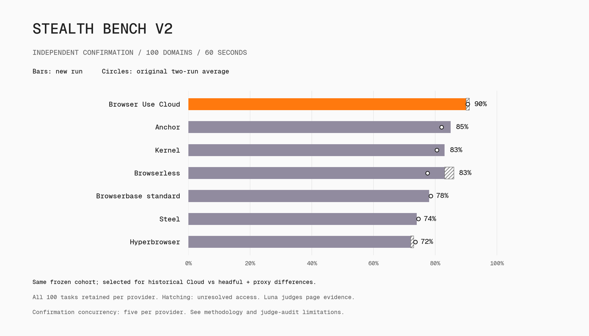

# Stealth Bench V2

Can a fresh browser reach ordinary, usable website content within **60 seconds**?

This is a deliberately difficult **100-domain access challenge**, selected using historical differences between Browser Use Cloud and stock headful Chromium with a US proxy. It is not a representative sample of the web and is not balanced by industry or anti-bot vendor. Membership was frozen before the new provider comparison; all 100 tasks stay in the denominator, including failures and unresolved measurements.

## Dataset

[Stealth_Bench_V2.enc](../Stealth_Bench_V2.enc) contains exactly 100 tasks and 100 distinct starting registered domains. There are 97 homepages and three generic public routes. There are no query strings, credentials, customer messages, private trace links, or customer-specific identifiers. Two starting domains can redirect to the same publisher, so unique starting domains do not imply unique final destinations.

The dataset follows this repository's encryption convention to discourage accidental training ingestion; the key is derived publicly and is not an access-control mechanism. Do not publish decrypted tasks or use them for training.

Every task has the same instruction, with its own URL:

> Open {URL} and determine whether genuine usable website content can be accessed within 60 seconds. A remaining CAPTCHA or bot/security denial prevents access. Do not sign in, submit forms, buy anything, or use another website.

This tests navigation only. It does not test filling a form, signing in, purchasing, searching, or an agent's ability to interact with a challenge.

## What executes and what judges

There is **no executor LLM and no self-reported success**. The pinned Playwright probe opens the URL once in a fresh browser session. Stock controls use unmodified Playwright Chromium; headful Linux runs under Xvfb. Stock controls use a 1365 × 900 content viewport. Other CDP providers receive that viewport setting. Cloud receives a 1365 × 900 screen request, while its content viewport remains provider-managed; the reviewed Cloud captures were 1365 pixels wide and 644–688 pixels high. This visible profile difference is part of the tested product configuration, not a pixel-matched browser-fingerprint experiment. Navigation waits up to 20 seconds for DOM content, then observation continues even when navigation times out.

Text, title, final URL, main-document response status and screenshots are captured at scheduled elapsed times of 20 and 60 seconds from navigation start. Browser provisioning and judgment are outside that window. Capturing the final evidence takes additional time; this is a 60-second observation target, not a 60-second wall-clock limit for the entire job.

The separate **Luna (gpt-5.6-luna, low reasoning)** judge reads the screenshots and page evidence. Browser identity, requested configuration, session IDs, candidate-screening signals and historical labels are omitted from its model input. Page contents remain untrusted evidence. Blinding cannot conceal visible differences in website responses.

The [full judge prompt](v2/judge.py) distinguishes:

| Outcome | Meaning |
| --- | --- |
| accessible | Ordinary, usable target content is visible at the final observation. |
| bot_block | A CAPTCHA, human-verification screen or bot/security denial still prevents access. |
| login_wall | Authentication is required. |
| site_error | A dead page, maintenance notice, 404 or unrelated server error. |
| network_error | A captured DNS, TLS or connectivity failure without bot-denial evidence. |
| uncertain | Missing, blank, contradictory or unverifiable evidence. |

An HTTP 200 does not prove access; a 403, 500 or redirect does not by itself prove a bot block. A CAPTCHA-related script in an otherwise usable page is not a block. A solved challenge passes only when genuine target content is visible at the end. Native provider CAPTCHA solvers may act during the observation window.

The primary descriptive metric is **confirmed access / all scheduled attempts**. Report unresolved counts and the possible-access upper bound alongside it. Unresolved observations and acquisition/judge errors have no primary per-task score; they are never relabeled as website blocks or silently removed. Two repetitions use fresh sessions. A single identical retry is permitted for missing acquisition, capture or infrastructure measurements; valid failures and uncertain rendered pages are retained. Keep originals and retry linkage.

## Browser configurations

| Configuration | Browser / networking / solver |
| --- | --- |
| Stock headless | Playwright Chromium, direct runner egress, no solver |
| Stock headful | Same Chromium, Xvfb, direct egress, no solver |
| Stock headless + US proxy | Same Chromium, Browser Use sticky US proxy, no solver |
| Stock headful + US proxy | Same Chromium, Xvfb, same proxy product, no solver |
| Browser Use Cloud | Cloud browser, US proxy, native CAPTCHA solver |
| Browser Use Cloud, solver off | Same requested Cloud settings with solver disabled |
| Browserbase, standard | Managed US proxy, native solver; standard and Verified are distinct modes |
| Kernel | Headful stealth mode, managed static ISP proxy and native solver |
| Anchor | Residential proxy, extra stealth and native solver |
| Hyperbrowser | Stealth, managed proxy and native solver |
| Steel | Managed proxy and native solver |
| Browserless | Stealth endpoint, US residential proxy, explicit native solver, 300-second session lifetime |

These are complete product configurations. Browser versions, proxy exits, network infrastructure and solver implementations differ. They do not isolate fingerprinting, and native provider defaults are not equivalent to identical proxy IPs. Requested settings are recorded; a successful session creation does not independently prove that every requested feature was active. Browserbase Verified requires an Enterprise plan according to the live API and is never silently substituted with standard mode.

In the measured headful comparison, 18 of 200 paired task/repetition outcomes passed only with the proxy and 10 passed only with direct egress: a net gain of eight attempts, or four percentage points. These are separate fresh sessions, not matched-IP causal interventions.

The historical selection explains why proxies may add little on this cohort: websites that benefited enough from headful plus proxy were less likely to enter this challenge. Do not generalize that observation to typical browsing. Do not select another subset based on these new provider scores and report it as an independent validation.

## Reproduce

Use Python 3.12 and Linux for the published stock-browser controls. Provider runs can execute elsewhere, but a different region or egress is a different experiment.

    cp .env.example .env
    # Set OPENAI_API_KEY for the judge and the chosen browser-provider key.
    uv run --with playwright==1.63.0 python -m playwright install --with-deps chromium
    # Linux headful controls also require Xvfb:
    sudo apt-get install -y xvfb

    # Two exact tasks to verify plumbing:
    uv run --locked --script stealth_bench/run.py --browser headful-proxy --task-ids shs100-001,shs100-002 --repetitions 1

    # Full, two-repeat comparison for one configuration:
    uv run --locked --script stealth_bench/run.py --browser browser-use --repetitions 2
    uv run --locked --script stealth_bench/run.py --browser browserbase --repetitions 2
    uv run --locked --script stealth_bench/run.py --browser kernel --repetitions 2

Run the script with --help for all configurations. The default concurrency is five. The published full runs used 20 for stock/Cloud, 10 for the other providers and five for corrected Browserless; small missing-measurement retries used two, except the 81-task Browserless resumption at five. Set `--concurrency` to match the configuration you are reproducing, within your account limits; do not run simultaneous repetitions against the same provider. Each invocation writes a new directory under ignored run_data/stealth_v2/, including the task list, hashes, requested settings, captures, judgments, per-attempt results and coverage summary. These files contain decrypted tasks and raw page content: keep them private.

The public probe and judge are byte-identical snapshots of the latest files used by the new evaluation platform. The provenance manifest records the earlier acquisition adapters used for the initial configurations; the navigation and judgment protocol is unchanged. [Protocol and dataset checksum](v2/protocol.json). Published results must retain the dataset checksum, source hashes, dates, all per-task outcomes and account/feature limitations. No percentage from the older 45-second experiment belongs in the 60-second chart.

Regenerate the committed light/dark charts from the published per-attempt outcomes without browser or judge API calls:

    uv run --script stealth_bench/generate_plots.py

The renderer verifies 100 unique task IDs in each repetition and checks every plotted aggregate against `attempts.jsonl`.

## Scope and release limitations

This is a useful regression challenge for protected-site access, not a web-wide success-rate estimate, a test of authentication, or proof that a stock browser can never proceed after interaction. Two repetitions reveal some variability but do not establish long-term reliability. Live websites and provider deployments change. Runtime screenshots can expose public names, IPs and challenge/session identifiers; the public result export excludes raw captures and private provenance.

## Provider preflight limitations

Browserbase standard mode completed preflight. Verified mode returned HTTP 403 with: “Verified mode is only available on the Enterprise plan.” Steel initially returned HTTP 403 / error code 1010 with urllib; an acquisition-only check succeeded with HTTPX, and the corrected adapter is used for scored Steel runs. Browserbase Verified has no website-access score. No plan was upgraded and no keys were published.

The first Browserless launch omitted explicit native solving and a sufficient session lifetime. That entire configuration was superseded; its attempts remain private diagnostics. The corrected configuration covers all 100 tasks twice. Its first launch exceeded the existing five-session concurrency cap and hit HTTP 429 during acquisition: 19 completed observations are retained, and only the 81 missing measurements receive their single retry at concurrency five. The unstarted second repetition was replaced in full at concurrency five. No task membership was changed.

## Visual audit and score sensitivity

The original two-repeat headline values are the frozen Luna judge's outputs, not human-certified ground truth. We visually reviewed 61 distinct attempt screenshots, including a fixed random sample of 20 tasks on Cloud and headful-plus-proxy (40 matched screenshots) with no outcome filter. That random sample supported the recorded classifications; it is not a full human relabeling of all 2,400 attempts. The visual audit found a concrete error: an earlier CAPTCHA was cited when the final capture had become blank. Age-verification overlays also expose ambiguity in the phrase "usable content": the model can accept underlying page text on one attempt and return uncertain on another. Proxy-provider blacklist pages are measured failed access, but their site/network subtype is not always consistent.

We retain every original verdict and do not selectively rerun or override these scores. A separate [sensitivity analysis](official_results/judge-sensitivity.json) treats both identified age-overlay tasks across **every configuration and repetition**, plus all uniform final screenshots found by an empty-body-text screen, as unresolved. It reports a lower and upper access bound on the same 200-attempt denominator. These are conservative checks for the identified cases, not statistical confidence intervals or proof that every remaining judgment is correct. The main chart's hatched extensions cover the judge's recorded unresolved results only; the sensitivity file additionally covers the audit flags.

The public result files contain the effective outcomes, original outcomes and retry outcomes keyed by configuration, repetition and task ID. `retry_used` means the one permitted missing-measurement retry was applied, even when it remained unresolved. Raw captures, reasons containing page text, session identifiers and private source links remain private.

## Independent provider confirmation

After the original comparison, the same 100 tasks were run once more for each of the seven managed providers: 700 original attempts plus nine one-time missing-measurement retries. Task membership, the 60-second observation and the access-v3 judge were unchanged. All providers used concurrency five, with task-order seed 20260930; some original runs used higher concurrency as documented above. Browserbase uses standard mode. The original two-repeat result files and charts remain unchanged.

| Provider | Original two-run average | Fresh confirmation | Unresolved /100 |
| --- | ---: | ---: | ---: |
| Browser Use Cloud | 90.5% | 90% | 1 |
| Browserbase standard | 78.5% | 78% | 0 |
| Kernel | 80.5% | 83% | 0 |
| Anchor | 82% | 85% | 0 |
| Hyperbrowser | 73.5% | 72% | 1 |
| Steel | 74.5% | 74% | 0 |
| Browserless | 77.5% | 83% | 3 |

<picture>
  <source media="(prefers-color-scheme: light)" srcset="official_plots/stealth_v2_confirmation_light.png">
  <source media="(prefers-color-scheme: dark)" srcset="official_plots/stealth_v2_confirmation_dark.png">
  
</picture>

The new run has five unresolved outcomes: Cloud one, Hyperbrowser one, Browserless three. Their possible-access upper bounds are 91%, 73% and 86%, respectively. All 100 scheduled tasks remain in each denominator. Valid failures and uncertain rendered pages were not retried. The chart's hatching represents recorded unresolved outcomes; circles show the original two-run averages.

A fixed sample of three task IDs per provider produced 21 reviewed screenshots. Nineteen supported the recorded classifications; one mostly blank page with a CAPTCHA badge did not establish the bot-block subtype, and one age/research overlay blurred the underlying content. No verdict was overridden. A separate conservative [sensitivity check](official_results/confirmation-20260925/judge-sensitivity.json) flags both previously identified overlay tasks across all providers and every complete final capture with empty body text. This broader screen includes some embedded challenges and image-only pages that may actually be classifiable; its bounds are not confidence intervals. Cloud's range for the identified cases is 89–92%, Anchor's 83–89%, and Browserless's 81–86%.

[All confirmation outcomes, originals, retries and provenance](official_results/confirmation-20260925/). These repeat the selected-cohort product comparison; they do not isolate fingerprinting or establish web-wide superiority. Regenerate the separate charts with:

    uv run --script stealth_bench/generate_confirmation_plot.py
